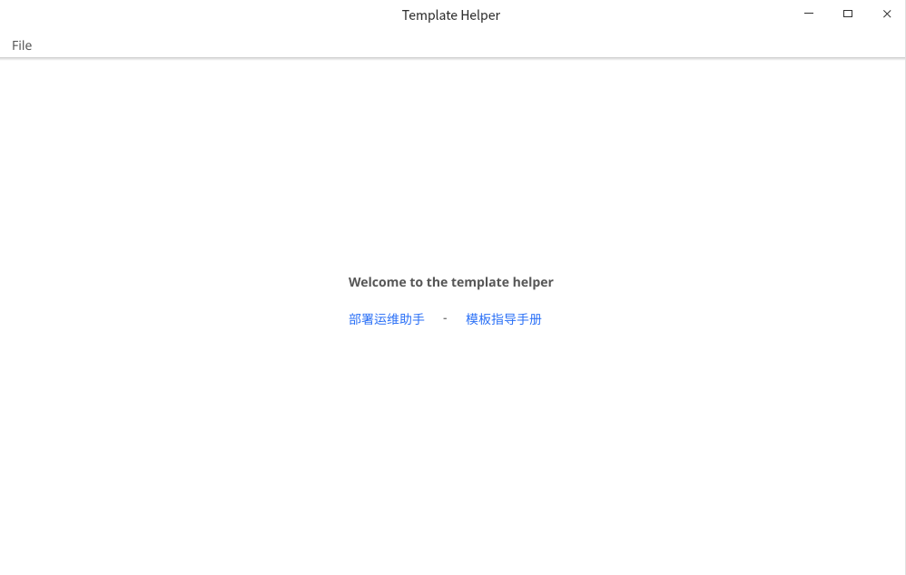
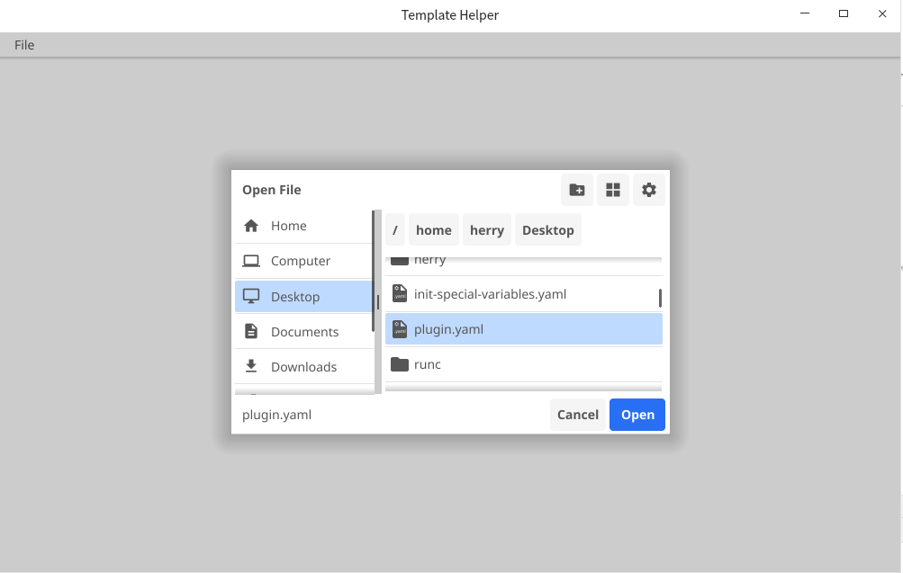
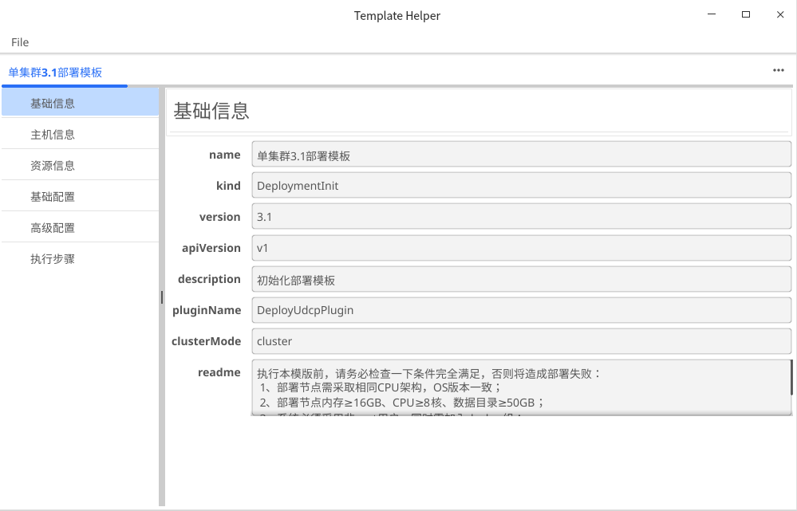
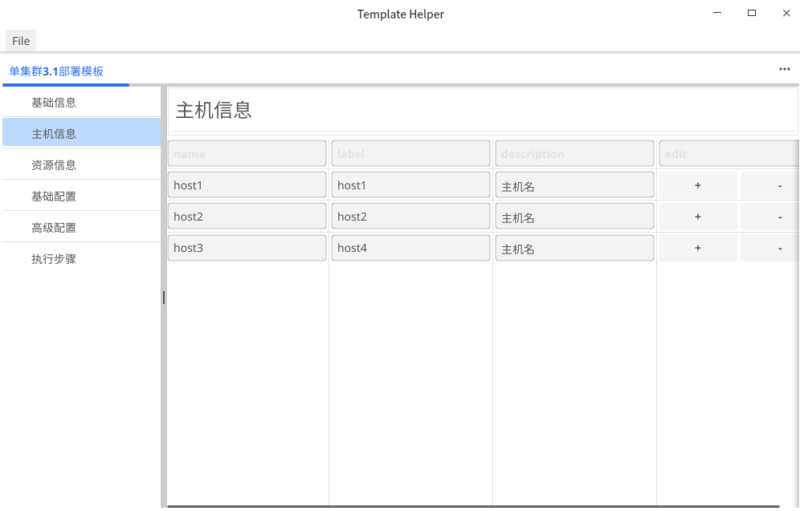
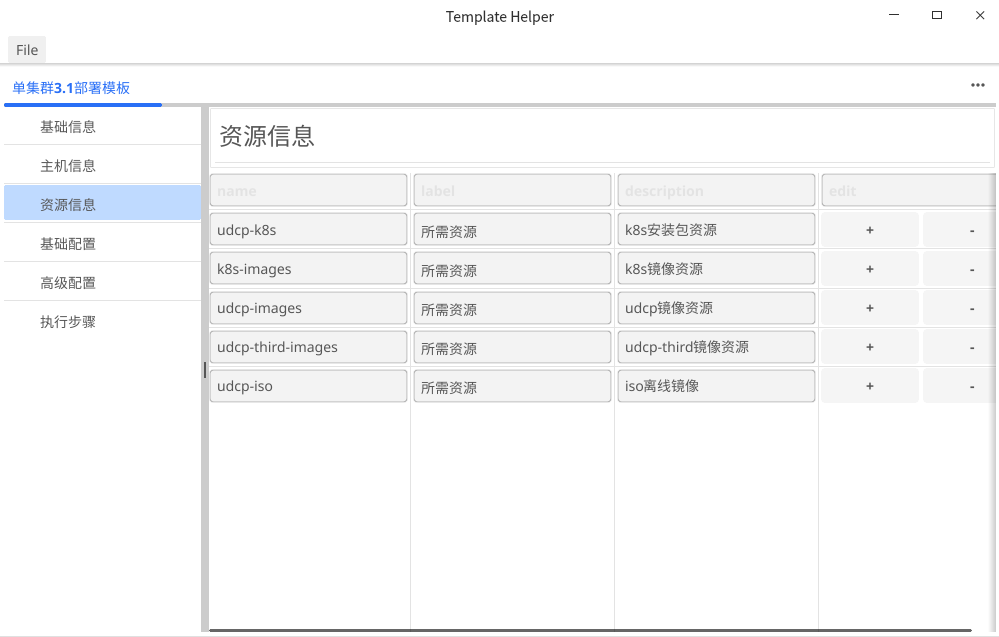
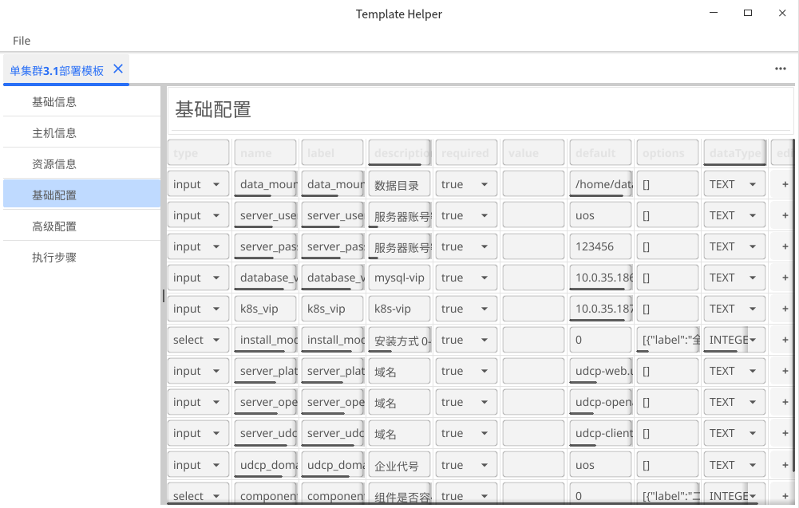
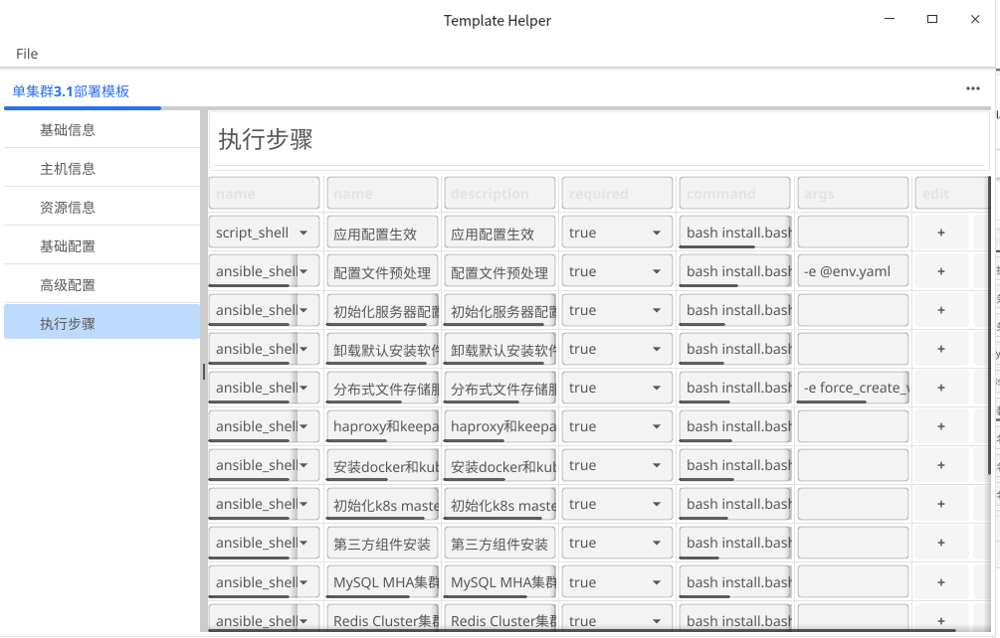
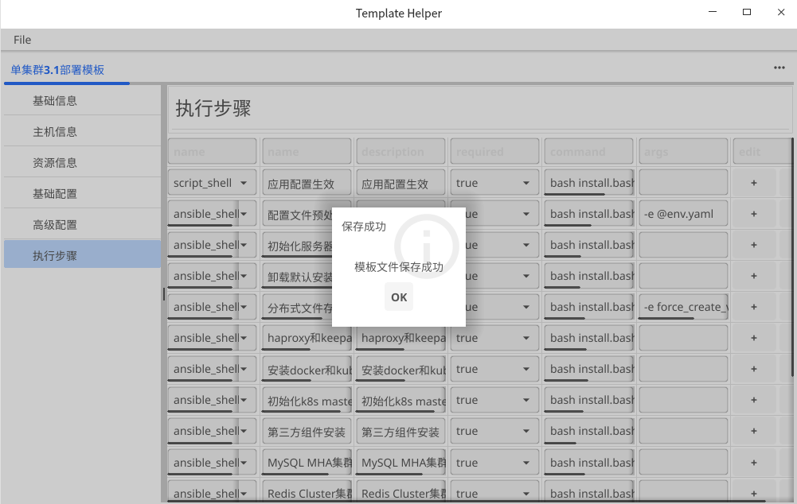

# template-helper
* a gui tool that supports YAML format template editing and preview, developed using the fyne

## build
```bash
bash build.sh
```

## install
```bash
make user-install
```

## uninstall
```bash
make user-uninstall
```


## 功能说明
- 首页
  
- 选择模板文件（yaml格式）
  
- 预览和编辑模板（基础信息）
  
- 预览和编辑模板（主机信息）
  
- 预览和编辑模板（资源信息）
  
- 预览和编辑模板（基础配置）
  
- 预览和编辑模板（执行步骤）
  
- 保存模板
      
